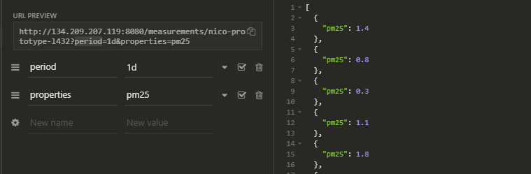

# Particula Backend

master:


develop:


## install

composer install

## to start-up

php -S localhost:3000  
vendor/bin/phinx migrate

## create new table

vendor/bin/phinx create MyNewMigration

## api-data-influxdb

De Hisorische data kan je opvragen door volgende stappen te volgen.
Eerst roepen we de server aan op de poort van de backend, hier vermelden we bij 
dat we de meetingen willen opvragen:

```
http://134.209.207.119:8080/measurements
```

door hierbij het id toe te voegen krijg je een specifieke sensor:

```
http://134.209.207.119:8080/measurements/nico-prototype-l432
```

Om data te kunnen weergeven moet je een periode en een propertie toevoegen:

```
http://134.209.207.119:8080/measurements/nico-prototype-l432?period=1d&properties=pm25
```

in dit geval voegen we de pm2.5 waarde van de sensor van nico dit van de afgelopen 24h.

Dit kan ook weergegeven worden dankzij insomnia:



Extra informatie in verband met de structuur van deze toepassing is te vinden op `https://app.swaggerhub.com/apis-docs/sillevl/Particula/0.1#/`

## Development

Check if the code complies to the PSR2 recommendations with the following command:

```bash
composer lint
```
