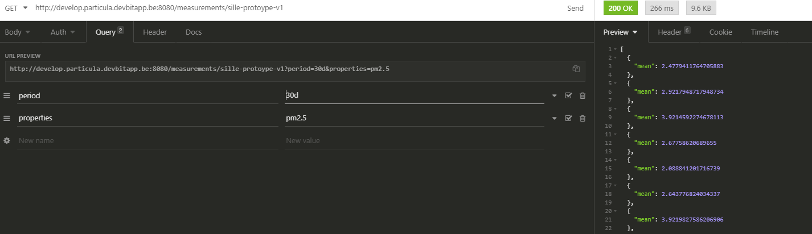
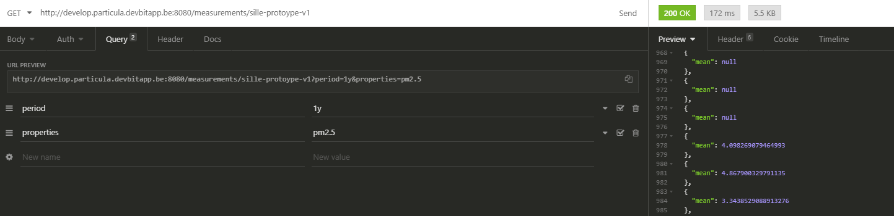
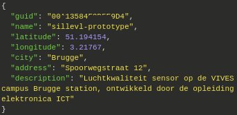
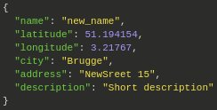
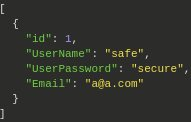
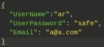
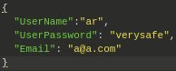

# Particula Backend

master:


develop:


## install

```bash
composer install
```

## make .env

coppy the .env.examble  
and change the name to .env

## make a mysql db

make sure your db_name in the env file is the same of the one you use for your mysql db

## to start-up

```bash
vendor/bin/phinx migrate  
php -S localhost:3000 -t public
```

## create new table

vendor/bin/phinx create MyNewMigration

## api-data-influxdb

De Hisorische data kan je opvragen door volgende stappen te volgen.
Van een sensor kunnen de peetingen opgevraagd worden via volgende url door gebruik te maken van zijn GUID.

```
https://develop.particula.devbitapp.be/measurements/{GUID}
```

Om data te kunnen weergeven moet je een periode meegeven: (Available values : 1h, 24h, 7d, 30d, 1y, 3y, all)

Default value : 24h

```
https://develop.particula.devbitapp.be/measurements/{GUID}?period=1h&properties=pm2.5
```

in dit geval voegen we de pm2.5 waarde van de sensor toe en dit voor het afgelopen 1h.

Dit kan ook weergegeven worden dankzij insomnia:


Wanneer waarden worden opgevraagt die groter zijn dan 1h (24h, 7d, 30d, 1y, 3y, all) wordt er gebruik gemaakt van gemiddeldes dit zodat het aantal responses beperkt blijft tot een 300-400 tal. 



Wanneer u data opvraagt die nog niet in de data base staat ontvangt u NULL voor de niet bestaande data zoals te zien is hieronder.



Extra informatie in verband met de structuur van deze toepassing is te vinden op `https://app.swaggerhub.com/apis-docs/sillevl/Particula/0.1#/`

## Routes for MariaDB

`Sensors` and `Users` are stored in a MariaDB database and can be managed with the information provided in this chapter. 

### Sensors

The sensors table can be managed using GET, POST, PUT and DELETE request. More information about each request is listed bellow.

All sensors with their information can be obtained with following GET request:

```
GET https://<ip>/sensors
```

The format of the result is specified at [SwaggerHub Particula](https://app.swaggerhub.com/apis-docs/sillevl/Particula), for example:



A sensor can be added to the database sending following POST request:

```
POST https://<ip>/sensors
```

A sensor can only be created if all information is entered:


A sensor can be edited by using the sensor GUID:

```
PUT https://<ip>/sensors/{GUID}
```



Finally a sensor can be removed by its GUID:

```
DELETE https://<ip>/sensors/{GUID}
```

### Users

Users can be managed using a GET, POST, PUT or DELETE request. More information about each request and its output can be found underneath.

A list of users can be found using:

```
GET https://<ip>/users
```



The information of one user can be found by adding the username to the previous request:

```
GET https://<ip>/users/{username}
```

A new user can be added as follows:

```
POST https://<ip>/users
```

A user can only be added if all of the following information is provided:



A user can be updated by its username:

```
PUT https://<ip>/users/{username}
```



At last a user can be deleted using a username:

```
DELETE https://<ip>/users/{username}
```

## Development

### Linter

Check if the code complies to the PSR2 recommendations with the following command:

```bash
composer lint
```

### Linter autofix

Some Linter errors and warnings can be fixed automatically. Use the following composer command:

```bash
composer lint-fix
```

### Migrations

To run a database migration use the command:

```bash
composer migrate
```
