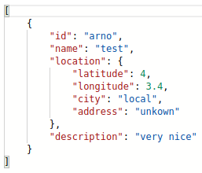
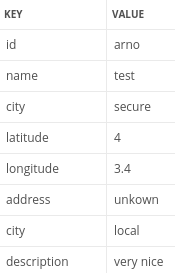
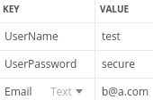

# Particula Backend

master:


develop:


## install

```bash
composer install
```

## make .env

coppy the .env.examble  
and change the name to .env

## make a mysql db

make sure your db_name in the env file is the same of the one you use for your mysql db

## to start-up

```bash
vendor/bin/phinx migrate  
php -S localhost:3000 -t public
```

## create new table

vendor/bin/phinx create MyNewMigration

## api-data-influxdb

De Hisorische data kan je opvragen door volgende stappen te volgen.
Eerst roepen we de server aan op de poort van de backend, hier vermelden we bij 
dat we de meetingen willen opvragen:

```
http://develop.particula.devbitapp.be:8080/measurements
```

door hierbij het id toe te voegen krijg je een specifieke sensor:

```
http://develop.particula.devbitapp.be:8080/measurements/nico-prototype-l432
```

Om data te kunnen weergeven moet je een periode en een propertie toevoegen:

```
http://develop.particula.devbitapp.be:8080/measurements/nico-prototype-l432?period=1d&properties=pm25
```

in dit geval voegen we de pm2.5 waarde van de sensor van nico dit van de afgelopen 24h.

Dit kan ook weergegeven worden dankzij insomnia:


Extra informatie in verband met de structuur van deze toepassing is te vinden op `https://app.swaggerhub.com/apis-docs/sillevl/Particula/0.1#/`

## routes for MariaDB

`Sensors` and `Users` are stored in a MariaDB database and can be accessed using the GET and POST requests found beneath. 

### Sensors

All sensors with their information can be obtained with following get request:

```
GET http://<ip>:8080/sensors
```

The format of the result is specified at `https://app.swaggerhub.com/apis-docs/sillevl/Particula/0.1#/`, for example:



A sensor can be added to the database sending following post request:

```
POST http://<ip>:8080/addsensor
```

A sensor can only be created if all information is entered:



### Users

A list of users can be found using a get request:

```
GET http://<ip>:8080/users
```

The information of once user can be found by adding the username to the previous request:

```
GET http://<ip>:8080/users/{username}
```

At last a user can be added keeping in mind that a username needs to be unique:

```
POST http://<ip>:8080/adduser
```

A user exists off the following information:



## Development

### Linter

Check if the code complies to the PSR2 recommendations with the following command:

```bash
composer lint
```

### Linter autofix

Some Linter errors and warnings can be fixed automatically. Use the following composer command:

```bash
composer lint-fix
```

### Migrations

To run a database migration use the command:

```bash
composer migrate
```
